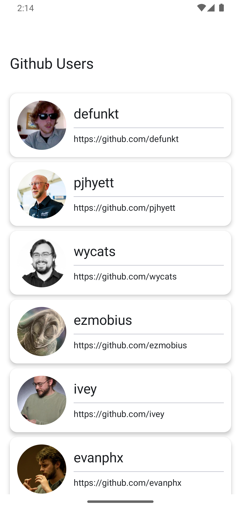
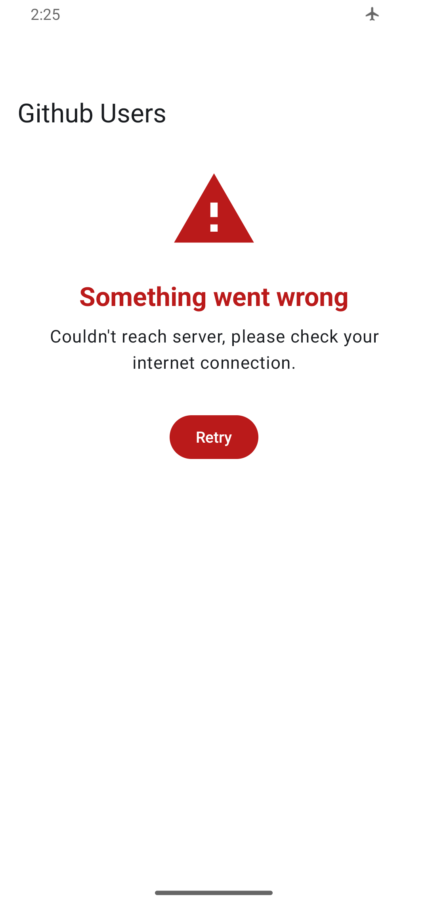
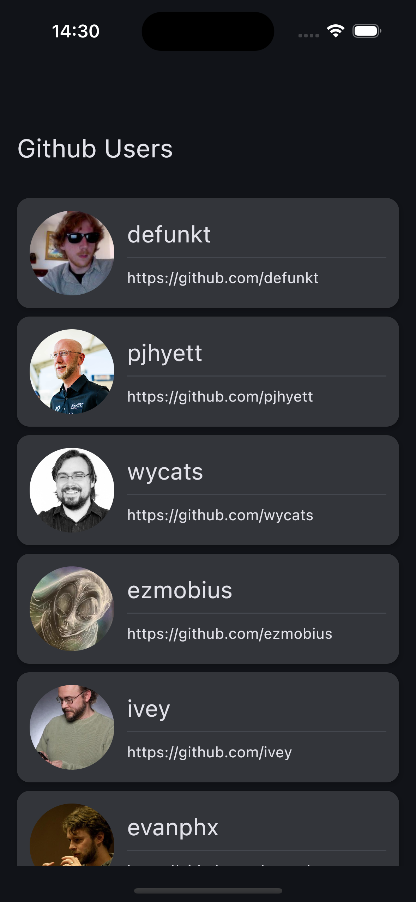
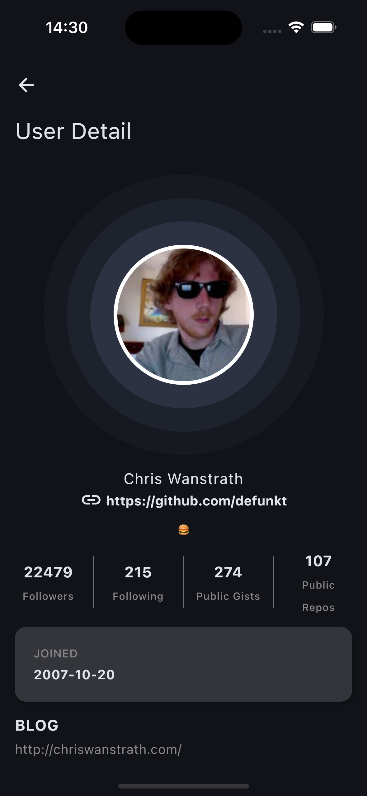
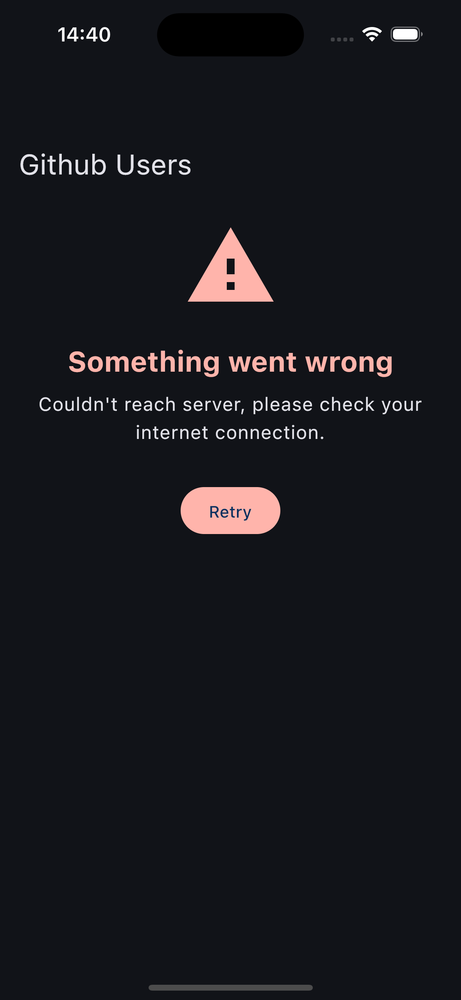
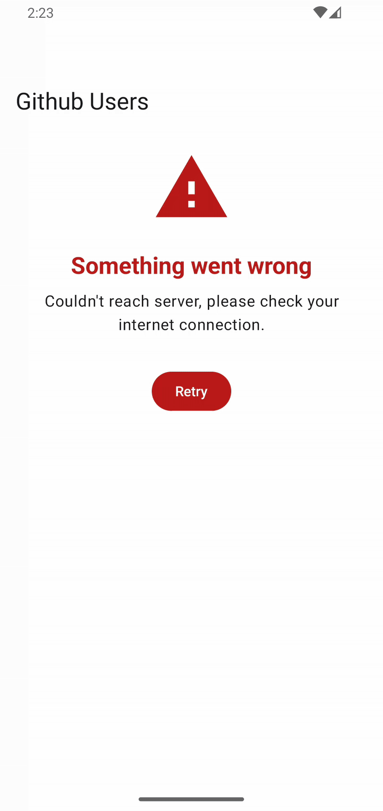
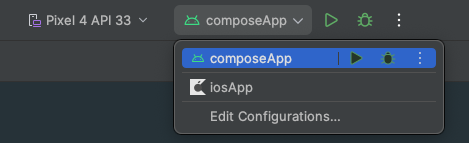

# KMPGithubClient – Compose Multiplatform GitHub User Explorer

**KMPGithubClient** is a **Compose Multiplatform** mobile app for **Android** and **iOS** that allows users to browse and view profiles of **GitHub users**. It demonstrates modern **Kotlin Multiplatform** practices, including **clean architecture**, **reactive programming**, and an **offline-first** approach.

## ✨ Features

- Browse a list of GitHub users fetched from the **GitHub API**.
- View detailed profiles for each user.
- **Scroll to load more** users as you reach the end of the list (pagination).
- **Offline support** with local caching via **Room**.
- Responsive **Material 3** design with **dark mode** support.
- Built with **clean architecture** for scalability and maintainability.
- **Compose Multiplatform** shared UI for Android and iOS.

## Screenshots:
<p>
  
  
  
</p>

<p>
  
  
  
</p>

### 🎬 Feature Demos

<p>
  
  
  
</p>

## 🛠️ Tech Stack

- **[Compose Multiplatform](https://github.com/JetBrains/compose-multiplatform)** – Shared declarative UI for Android & iOS.
- **[Kotlin Coroutines](https://github.com/Kotlin/kotlinx.coroutines)** & **Flow** – For asynchronous and reactive programming.
- **[Room](https://developer.android.com/kotlin/multiplatform/room)** – Local database (offline-first strategy).
- **[Coil](https://github.com/coil-kt/coil)** – Image loading and caching for Compose Multiplatform.
- **[Ktor](https://ktor.io/)** – Networking and GitHub API integration.
- **[ViewModel](https://www.jetbrains.com/help/kotlin-multiplatform-dev/compose-viewmodel.html)** – State management.
- **[Koin](https://insert-koin.io/)** – Dependency injection.
- **[Compose Material 3](https://developer.android.com/jetpack/androidx/releases/compose-material3)** – UI components and theming.

## 🚀 Getting Started

### Prerequisites

- [Android Studio](https://developer.android.com/studio) (latest stable version with KMP support)
- JDK 17 or higher
- Xcode (for building and running on iOS)

### Build & Run

1. Clone the repository and open it in Android Studio.
2. Sync Gradle.
3. Select the target platform: **Android** or **iOS**



4. Run the app.

> _Note: Ensure you have the necessary environment set up for Kotlin Multiplatform development for both Android and iOS._

## 🏛️ Project Structure

```plaintext
├── core                 # Core utilities shared across the app (e.g., HTTP client, result handling, date utilities)
├── design_system        # UI components, theming, and utility functions for consistent design across the app
├── di                   # Dependency injection setup (Koin modules and initialization)
└── user                 # Feature module for GitHub users
    ├── data             # Data layer: local database, remote API, data sources, mappers
    │   ├── local        # Room database setup and entities
    │   └── remote       # Ktor API data sources and DTOs
    ├── domain           # Domain layer: business logic, models, use cases, repository interfaces
    └── presentation     # Presentation layer: UI screens, state management, ViewModels, navigation
